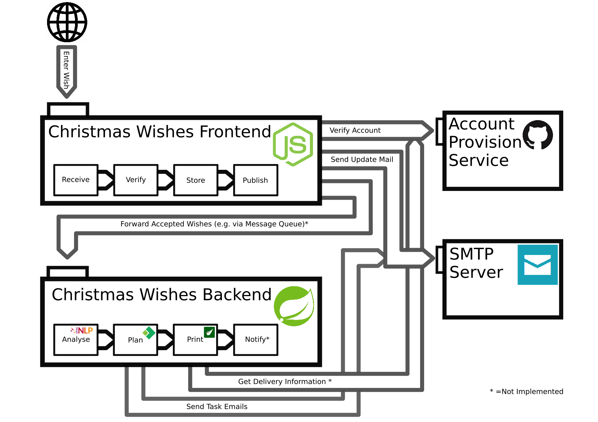

### Christmas Messages backend application

*Storytime*

Santa: Our new Webpage is live, so Children all around the world can send us their Christmas wishes at https://lucky-successful-arrhinceratops.glitch.me/ 

Elf: But, what happens to the messages that children send to our Frontend, Santa?

Santa: We store them in a database, and I get mails about the wishes inside.

Elf: Shouldn't we start to prepare the packages somehow?

Santa: Good idea. Lets build an app for that.  

*and so to process the messages efficiently the elves built a small app...*

### Santas IT Infrastructure

This project implements the Christmas Wishes Backend application.

This projects main goal is to analyse the messages, and generate more readable wish list documents from the incoming messages, so the elves can assemble the christmas presents more efficiently.   
This Spring boot backend exposes and API on /christmasMessages/ which starts a business process around the Christmas letters published by the frontend application.
  
There are 3 additional major components
* OpenNLP: To analyse the content and extract wishes and feedback for Santa
* activiti: To request a manual analysis, and send tasks to the packaging team
* thymeleaf: To provide efficient wish list documents as pdf files.

The BPM Process implemented with activiti is this one. (src/main/resources/processes/ChristmasProcess.bpmn) 

activiti sends emails to the corresponding teams whenever tasks for them are to be done. The emails contain information on what to do. The tasks get closed, when the corresponding API calls are performed.
The postman collection in /postman/ gives a good hint on how the processes might look like.

Be aware that currently several things are still missing for the project and the overall architecture that might come in future upgrades:
* The wish list document to contain package labels with sender and receiver information (requires api call to get receiver info)
* A working middleware component forwarding messages from the Node Frontend.
* Closing of wish lists once everything has been done, and forwarding that to the Frontend, to have current information in the mail that Santa gets. 
* Deployment of a production environment and integration with Node Frontend.  

